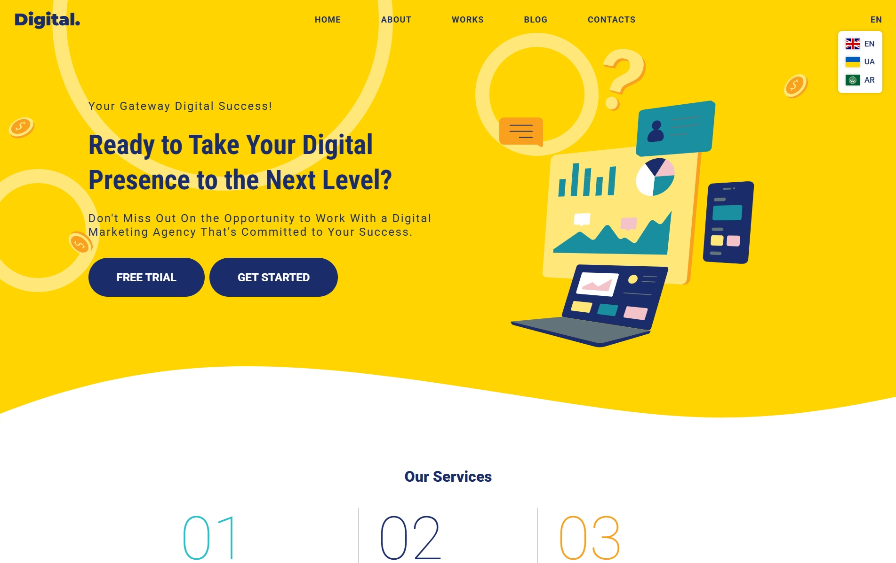

# Digital Landing Page (Multi-language + CSS Logical Properties)

This project is a modern, responsive landing page designed to demonstrate the practical use of **CSS logical properties** and **multi-language layout handling**, including **right-to-left (RTL)** support.



## ✨ Key Features

- 🧠 **Logical CSS** used throughout — `margin-inline-start`, `inset-block-end`, `border-start`, etc.
- 📐 **Layout adapts** automatically to LTR or RTL based on the `dir` attribute.
- 🌍 **Multilingual support** with language switcher (EN / UA / AR).
- 🧩 **Modular structure** — sections and UI elements are isolated and easy to reuse.
- 📱 **Fully responsive** and mobile-friendly.
- 🎨 **Custom illustrations**, SVG icons, and a single SVG sprite.
- ⚙️ **Smooth animations** and Swiper.js integration for sliders.

## 🧩 Fully Component-Based Architecture

The entire site is built from reusable, modular components — not just individual sections like Hero or Services, but also internal parts such as service items, review cards, language switcher, pricing plans, and more.

Each component is structured with its own `HTML`, `SCSS`, and optionally `JS`.

Dynamic content is injected using `locals='{...}'`, similar to `props` in React — allowing for content reuse, localization, and fast UI composition.

## 🗂 Project Structure

```
├── index.html         # English version
├── index-ua.html      # Ukrainian version
├── index-ar.html      # Arabic (RTL) version
├── preview.jpg        # Screenshot preview
├── styles/            # SCSS files (using logical properties)
├── js/                # Interactivity (sliders, language switcher, etc.)
└── assets/            # Fonts, images, SVGs, and sprite
```

⭐ The project follows a modular architecture for maintainability, rapid development, and seamless localization.

## 📌 Live Demo

🔗 [https://valentyn-m.github.io/Digital](https://valentyn-m.github.io/Digital)

## 🧪 Learning Objectives

This project is ideal if you want to:

- 🧠 Practice applying **CSS logical properties** in real-world layout scenarios.
- 🌐 Learn how to build a **multi-language website** with proper semantic structure and visual consistency.
- 🧭 Understand **RTL layout behavior** and techniques to handle direction-sensitive elements (e.g., flipping images with `transform: scaleX(-1)`).

---

## 👨‍💻 Author

Created by [Valentyn Mostovyi](https://github.com/Valentyn-M)
